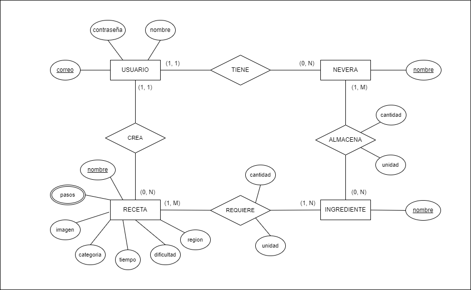

# Modelo de datos

## Modelo entidad-relación

El siguiente diagrama representa el modelo conceptual de la base de datos de RecipeBook.

## Entidades

### Usuario
Representa a un usuario registrado en la aplicación.

- id
- email
- password
- nombre

### Nevera
Representa una nevera perteneciente a un usuario.

- id
- nombre
- user_id

### Ingrediente
Representa un ingrediente reutilizable en recetas y neveras.

- id
- nombre

### Receta
Representa una receta creada por un usuario, guardada o importada desde una API externa.

- id
- nombre
- pasos
- imagen
- tiempo
- dificultad
- categoría
- región geográfica
- user_id
