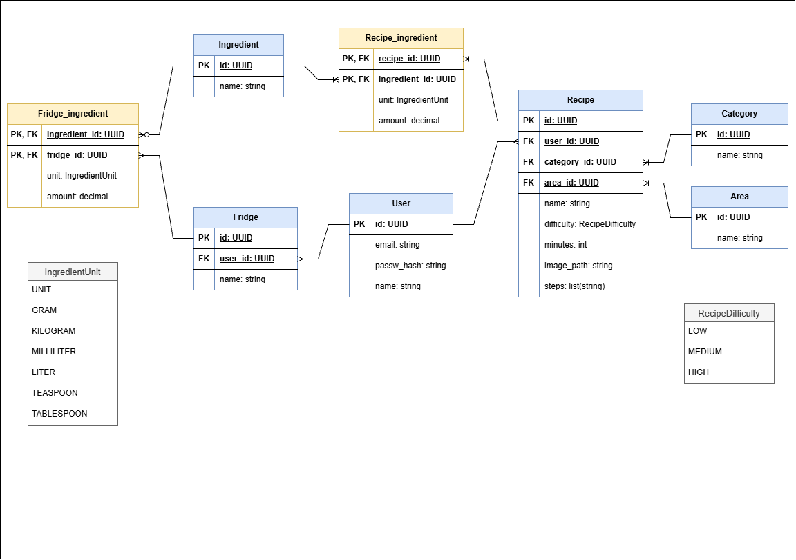

# Modelo de datos

## Modelo entidad-relación

El siguiente diagrama representa el modelo conceptual de la base de datos de RecipeBook.

### Entidades

#### Usuario

Representa a un usuario registrado en la aplicación.

- id
- email
- password
- nombre

#### Nevera

Representa una nevera perteneciente a un usuario.

- id
- nombre

#### Ingrediente

Representa un ingrediente reutilizable en recetas y neveras.

- id
- nombre

#### Receta

Representa una receta creada por un usuario.

- id
- nombre
- pasos
- imagen
- tiempo
- dificultad

#### Categoría

Representa una categoría a la que pertenece una receta.

- id
- nombre

#### Área

Representa el área geográfica o tradición culinaria asociada a una receta.

- id
- nombre

### Relaciones

- Un usuario puede tener varias neveras.
- Una nevera pertenece a un único usuario.
- Un usuario puede crear varias recetas.
- Una receta pertenece a un único usuario.
- Una categoría puede tener varias recetas.
- Una receta pertenece a una única categoría.
- Un área puede tener varias recetas.
- Una receta pertenece a una única área.
- Una nevera puede contener varios ingredientes.
- Un ingrediente puede estar presente en varias neveras.
- Una receta puede utilizar varios ingredientes.
- Un ingrediente puede utilizarse en varias recetas.

Las relaciones muchos a muchos entre `Nevera` e `Ingrediente`, y entre `Receta` e `Ingrediente`, se materializan mediante las entidades intermedias `Fridge_ingredient` y `Recipe_ingredient`.

## Modelo lógico

El siguiente diagrama representa el modelo lógico de la base de datos, incluyendo las claves primarias, claves foráneas, atributos y tablas intermedias.

### Fridge_ingredient

Entidad intermedia que representa los ingredientes almacenados en una nevera.

| Campo | Tipo | Clave |
|---|---|---|
| fridge_id | UUID | PK, FK → Fridge.id |
| ingredient_id | UUID | PK, FK → Ingredient.id |
| quantity | decimal | |
| unit | IngredientUnit | |

La clave primaria está compuesta por `fridge_id` e `ingredient_id`, de forma que un mismo ingrediente no puede aparecer más de una vez en la misma nevera.

### Recipe_ingredient

Entidad intermedia que representa los ingredientes utilizados en una receta.

| Campo | Tipo | Clave |
|---|---|---|
| recipe_id | UUID | PK, FK → Recipe.id |
| ingredient_id | UUID | PK, FK → Ingredient.id |
| quantity | decimal | |
| unit | IngredientUnit | |

La clave primaria está compuesta por `recipe_id` e `ingredient_id`.

## Enumeraciones

### RecipeDifficulty

Representa el nivel de dificultad de una receta.

- LOW
- MEDIUM
- HIGH

### IngredientUnit

Representa la unidad utilizada para expresar la cantidad de un ingrediente.

- UNIT
- GRAM
- KILOGRAM
- MILLILITER
- LITER
- TEASPOON
- TABLESPOON